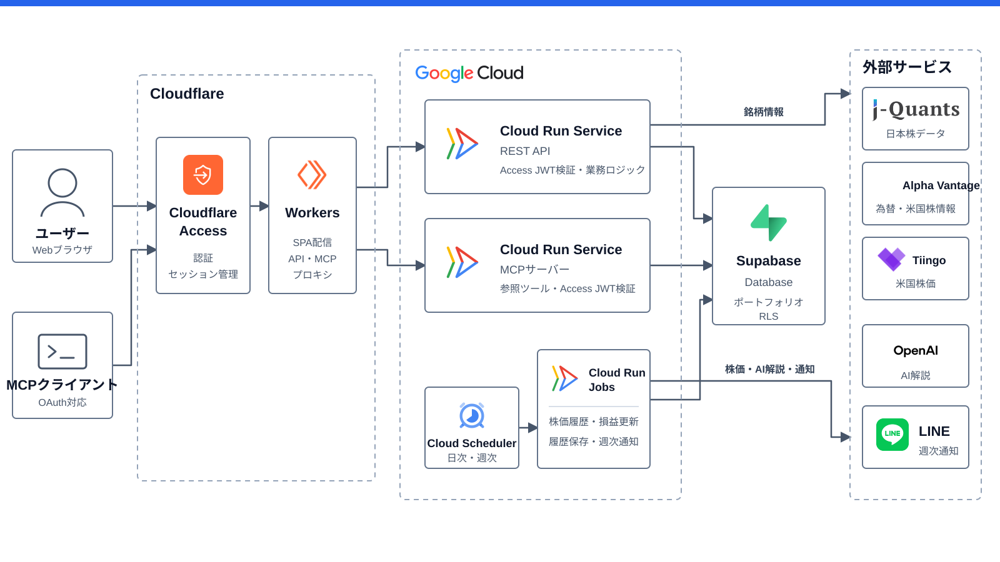

# InvestLogix

InvestLogixは、日本株・米国株の取引/保有/配当を記録し、ポートフォリオを可視化するWebアプリケーションです。

- バックエンド: FastAPI（`src/api`）
- フロントエンド: React + Vite（`src/web`）
- DB: PostgreSQL（ローカル開発はDocker推奨）

## 主な機能

- 銘柄管理（日本株・米国株、銘柄詳細情報）
- 取引管理（購入/売却、口座種別、月次/年次サマリー）
- 保有株管理（平均取得単価・口座種別ごとの保有数量の自動計算、評価損益）
- 配当管理（配当履歴、月次集計、銘柄別集計）
- ポートフォリオ分析（資産推移、通貨/市場別の分布、銘柄別配当割合、サマリー）
- Slack通知（カスタムアプリとのDMへ送る週次レポート）
- 認証（Cloudflare Access）
- OAuth対応MCP（保有銘柄の一覧・並び替え・詳細参照）

## 構成



### アプリ
- フロントエンド: React（Vite）
- バックエンド: FastAPI（Python 3.13）
- 定時ジョブ: Python（`python -m` で起動）
- DB: PostgreSQL

### インフラ
- フロントエンド: Cloudflare Workers（Static Assets）
  - `/api/*` と `/mcp` は Worker が別々の Cloud Run サービスへプロキシする
  - オリジンは Worker の Secret（`API_ORIGIN` / `MCP_ORIGIN`）に置くため、リポジトリにもクライアントバンドルにも現れない
- 認証: Cloudflare Access（Zero Trust）
  - 本人確認とログインセッションはAccessが持つ。アプリはパスワードも独自トークンも保持しない
  - APIは全リクエストで `Cf-Access-Jwt-Assertion` の署名・issuer・audience・有効期限を検証し、Cloudflareを迂回した直アクセスを拒否する
  - `user_id` の紐付け、管理者権限、PostgreSQL RLS はアプリ側の責務
  - 設定手順は [`infra/README.md`](infra/README.md) を参照
- バックエンド: Google Cloud Run
  - API は Cloud Run Service
  - MCP は別の Cloud Run Service（公式Python SDK / Streamable HTTP）
  - 定時ジョブは Cloud Run Jobs ＋ Cloud Scheduler
- DB: Supabase（マネージド PostgreSQL）
- シークレットは事前に Secret Manager に登録
- 上記の構造（env, IAM, scaling, cron 等）は OpenTofu でプロビジョニング

### デプロイと運用
- アプリのデプロイ: フロントは `web-cd.yml` による Cloudflare Workers 自動デプロイ、バックエンドは Cloud Build による Cloud Run 自動デプロイ
- インフラ構造の変更: `infra/*.tf` を編集して `tofu apply`
- シークレット値の更新: `gcloud secrets versions add`（Terraform は値を持たない）
- Cloud Run Jobs のイメージ更新: mainマージ時に `api-cd.yml` がAPIと同じイメージへ更新
- 株価データは `price_history` テーブルから読み込む。日次バッチ `recalc-holdings` が冒頭で直近2週間分を upsert する。新規環境やマイグレーション直後はテーブルが空でダッシュボードに評価額が出ないため、`gcloud run jobs execute recalc-holdings` で手動実行するか翌朝のスケジュール実行を待つ

### Slack通知へ切り替えるときの順序

`main` へのマージでAPIとCloud Run Jobsが自動デプロイされるため、次の順序で準備する。

1. `slack-app-manifest.yaml` からSlackアプリを作成・インストールし、Bot User OAuth Tokenを取得する
2. `SLACK_BOT_TOKEN` をSecret Managerへ追加し、このブランチの `infra/` で `tofu apply` してCloud Run Service / Jobsへ紐付ける
3. 本番DBの認証情報を設定した環境で、このブランチの `src/api` から `uv run alembic upgrade head` を実行する
4. ローカルでSlack通知を確認してからマージし、デプロイ後は `update-and-notify` Jobを手動実行してSlackアプリとのDMへの到着を確認する

このマイグレーションは `line_user_id` を削除して `slack_user_id` を追加する。LINEとSlackのIDに互換性はない。

### 依存関係の防御
サプライチェーン攻撃対策として [Socket Firewall Free](https://docs.socket.dev/docs/socket-firewall-free) を導入しています。依存関係を取得するときは `sfw` 経由で実行します。

## リポジトリ構成

```
InvestLogix/
├── src/
│   ├── api/                 # FastAPI API + 定時ジョブ
│   ├── web/                 # React + Vite SPA
│   ├── docker-compose.yaml  # ローカル開発用（DB + API）
│   └── Dockerfile           # API のコンテナイメージ
├── infra/                   # OpenTofu (Google Cloud)
├── scripts/                 # 運用スクリプト（Cloud Run Jobs 更新等）
└── samples/                 # SBI証券エクスポートサンプル
```

## クイックスタート（ローカル開発）

### 1) DB + API を起動（Docker）

```bash
cd src
docker compose up -d --build
```

- API: `http://localhost:8000`
- APIドキュメント（Swagger）: `http://localhost:8000/docs`

MCPも起動する場合:

```bash
cd src/api
uv run uvicorn stock.mcp.app:app --reload --port 8001
```

- MCP: `http://localhost:8001/mcp`
- `DEV_AUTH_EMAIL` のユーザーへ解決し、RESTと同じRLSを適用する

停止する場合:

```bash
cd src
docker compose down
```

### 2) 定時ジョブを手動実行（Docker）

Docker Compose で API コンテナを起動した状態で、必要なジョブだけ実行します。

```bash
cd src

# 保有銘柄の株価履歴を更新し、損益を再計算
docker compose exec api uv run python -m stock.jobs.recalc_holdings

# ポートフォリオ履歴を保存し、Slack通知を送信
docker compose exec api uv run python -m stock.jobs.update_and_notify
```

### Slack通知の初期設定

1. [`slack-app-manifest.yaml`](slack-app-manifest.yaml) を使ってSlackカスタムアプリを作成する
2. アプリをワークスペースへインストールし、Bot User OAuth Tokenを`SLACK_BOT_TOKEN`として保存する
3. Slackプロフィールの「メンバーID」を`PUT /api/v1/users/me/slack-user-id`で登録する

LINEのUser IDとSlackのUser IDに互換性はないため、デプロイ後に通知先の再登録が必要です。

### 3) Web を起動

```bash
cd src/web
sfw pnpm install
pnpm dev
```

- 起動後のURLはViteの表示（通常は `http://localhost:5173`）に従ってください
- フロントは API を同一オリジンの相対パス（`/api/*`）で叩きます。開発時は Vite の dev proxy が `http://localhost:8000` へ転送するため、環境変数の設定は不要です
- 転送先を変えたい場合のみ `API_PROXY_TARGET` を指定してください（Docker Compose では `http://api:8000` を渡しています）

### 4) Cloudflare Worker 込みで確認する（任意）

本番と同じ経路（Workerが `/api/*` をプロキシする形）を手元で再現したい場合のみ実行します。

```bash
cd src/web
printf 'API_ORIGIN=http://localhost:8000\nMCP_ORIGIN=http://localhost:8001\n' > .dev.vars
pnpm build && pnpm cf-dev
```

`.dev.vars` は gitignore 済みです。バックエンドのURLが入るためコミットしないでください。

## 開発（詳細）

### Backend（`src/api`）

前提: Python（3.13+）、`uv`、`sfw`、DB（Docker or 別途用意）

```bash
cd src/api
cp .env.sample .env
sfw uv sync
uv run alembic upgrade head
uv run uvicorn stock.app:app --reload --port 8000
```

注意:

- `src/docker-compose.yaml` のDBは `POSTGRES_PASSWORD=hogehoge` が固定です。DockerのDBを使う場合は
  `src/api/.env` の `DB_PASSWORD` を合わせるか、`src/docker-compose.yaml` を修正してください。
- CORSの設定は不要です。フロントは Vite の dev proxy（本番はCloudflare Worker）経由でAPIを叩くため、
  ブラウザから見て常に同一オリジンになります。
- ローカルでは Cloudflare Access を経由しないため、`src/api/.env` に `DEV_AUTH_EMAIL` を設定します。
  そのメールアドレスのユーザーとしてログイン済み扱いになります（対象ユーザーは `users` テーブルに
  必要です）。`ENVIRONMENT=production` では設定できず、設定されていると起動時にエラーになります。

### Frontend（`src/web`）

```bash
cd src/web
pnpm dev
pnpm check
```

## 環境変数

- Backend: `src/api/.env.sample` を参考に `src/api/.env` を作成
  - 認証: 本番は `CF_ACCESS_TEAM_DOMAIN` と `CF_ACCESS_AUD`（Cloudflare Zero Trust から取得）。ローカルは代わりに `DEV_AUTH_EMAIL` を使う
- Frontend: 通常は設定不要。Vite の dev proxy の転送先を変える場合のみ `API_PROXY_TARGET` を指定する
- Cloudflare Worker: オリジンは `API_ORIGIN` / `MCP_ORIGIN`。本番は `wrangler secret put`、手元は `src/web/.dev.vars` に置く（どちらもリポジトリには入れない）

## API仕様

APIエンドポイントの一覧は手書きでは管理せず、以下を正とします。

- `http://localhost:8000/docs`（Swagger UI）
- `http://localhost:8000/openapi.json`（OpenAPI）

## ライセンス

MIT License（`LICENSE` を参照）
